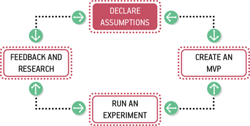
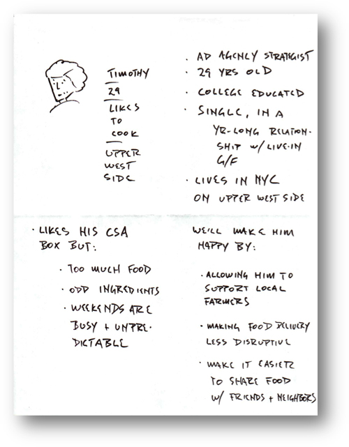
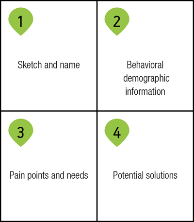
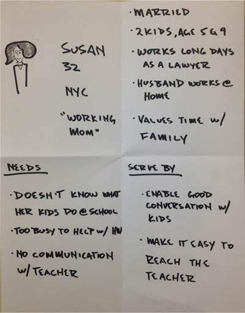
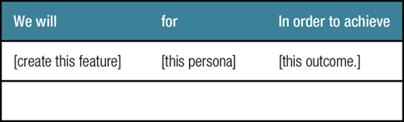

# Visión, encuadre y resultados
*Si no está de acuerdo con el experimento, está mal.* Dr. Richard Feynman

Tradicionalmente, los proyectos de diseño de UX están enmarcados por requisitos y entregables; los equipos reciben requisitos y se espera que produzcan entregables. Lean UX cambia radicalmente la forma en que enmarcamos nuestro trabajo. Nuestro objetivo no es crear un entregable, es cambiar algo en el mundo, crear un resultado. Comenzamos con suposiciones en lugar de requisitos. Creamos y probamos hipótesis. Medimos para ver si hemos logrado los resultados deseados.

Este capítulo cubre la principal herramienta del trabajo centrado en resultados: el enunciado de hipótesis. La declaración de hipótesis es el punto de partida de un proyecto. Establece una visión clara del trabajo y cambia la conversación entre los miembros del equipo y sus gerentes de los resultados (p. Ej., "Crearemos una función de inicio de sesión único") a los resultados (p. Ej., "Queremos aumentar el número de nuevos carteles -hasta nuestro servicio ”).

El enunciado de hipótesis es una forma de expresar supuestos en forma comprobable. Está compuesto por los siguientes elementos:

- Supuestos:
Una declaración de alto nivel de lo que creemos que es verdad.

- Hipótesis:
Descripciones más detalladas de nuestras suposiciones que apuntan a áreas específicas de nuestro producto o flujo de trabajo para la experimentación.

- Resultados: 
La señal que buscamos del mercado para ayudarnos a validar o invalidar nuestras hipótesis. Suelen ser cuantitativos, pero también pueden ser cualitativos.

- Personas:
Modelos de las personas para las que creemos que estamos resolviendo un problema.

- Caracteristicas:
Los cambios o mejoras del producto que creemos impulsarán los resultados que buscamos.

Echemos un vistazo a cada uno de estos elementos con más detalle.

## Supuestos
El primer paso en el proceso Lean UX es declarar sus suposiciones. Cada proyecto comienza con suposiciones, pero generalmente no reconocemos este hecho de manera explícita. En cambio, intentamos ignorar las suposiciones o, peor aún, tratarlas como hechos.

Declarar sus suposiciones le permite a su equipo crear un punto de partida común. Al hacer esto en equipo, le da a cada miembro del equipo, tanto diseñadores como no diseñadores, la oportunidad de expresar su opinión sobre la mejor manera de resolver el problema. Al realizar un ejercicio de declaración de supuestos, se plasman las ideas de todos en la pizarra. Revela la divergencia de opiniones del equipo y también expone un amplio conjunto de posibles soluciones.

Declarar supuestos es el primer paso en el proceso Lean UX:

###  Método: declaración de supuestos
#### OMS
La declaración de supuestos es un ejercicio de grupo. Reúna a su equipo, asegurándose de que todas las disciplinas estén representadas, incluidos los expertos en la materia que puedan tener conocimientos vitales sobre su proyecto. Por ejemplo, si está manejando una queja frecuente de un cliente, podría ser beneficioso incluir un representante de servicio al cliente de su centro de llamadas. Los representantes del centro de llamadas hablan con más clientes que cualquier otra persona en la organización y probablemente tendrán información que el resto del equipo no tendrá.

#### Preparación
Notifique al equipo con anticipación el problema que abordarán para que todos tengan la oportunidad de preparar cualquier material que necesiten o realizar cualquier investigación relacionada antes de comenzar. Las cosas importantes para prepararse con anticipación incluyen:

1. Informes de análisis que muestran cómo se está utilizando el producto actual.

2. Informes de usabilidad que ilustran por qué los clientes realizan determinadas acciones en su producto

3. Información sobre intentos anteriores de solucionar este problema y sus éxitos y fracasos.

4. Análisis del grupo de interés empresarial sobre cómo la solución de este problema afectará el desempeño de la empresa

5. Análisis competitivos que muestran cómo los competidores abordan los mismos problemas

### Método: Declaración del problema

El equipo debe tener un punto de partida para el ejercicio. Me ha resultado útil comenzar con una declaración de problema. (Consulte la plantilla para esta declaración más adelante en esta sección). La declaración del problema le da a su equipo un enfoque claro para su trabajo. También define las limitaciones importantes. Necesita limitaciones para el trabajo en grupo. Proporcionan las barandillas que mantienen al equipo conectado a tierra y alineado.

#### Plantilla de declaración de problema
Los enunciados de problemas se componen de tres elementos:

1. Los objetivos actuales del producto o sistema.

2. El problema que el interesado quiere abordar (es decir, dónde no se están cumpliendo los objetivos)

3. Una solicitud explícita de mejora que no dicta una solución específica

*Modelo*

**[Nuestro servicio / producto]** fue diseñado para lograr **[estos objetivos]** . Hemos observado que el producto / servicio no está cumpliendo **[estos objetivos]** , lo que está provocando **[este efecto adverso]** en nuestro negocio. ¿Cómo podríamos mejorar **[servicio / producto]** para que nuestros clientes tengan más éxito en base a **[estos criterios medibles]**

Por ejemplo, aquí hay una declaración de problema que usamos para comenzar un proyecto en TheLadders, una firma de reclutamiento en línea donde trabajé. (Verá muchos más ejemplos de TheLadders a lo largo de este libro).

Nuestro servicio ofrece un conducto entre los solicitantes de empleo y los empleadores que intentan contratarlos. A través de nuestro servicio, los empleadores pueden llegar a los solicitantes de empleo en nuestro ecosistema con oportunidades de empleo. Hemos observado que un factor crítico que afecta la satisfacción del cliente es la frecuencia con la que los solicitantes de empleo responden a los mensajes de los empleadores. Actualmente, los solicitantes de empleo están respondiendo a estas comunicaciones a un ritmo muy bajo. ¿Cómo podríamos mejorar la eficacia de nuestros productos de comunicación, logrando así que los empleadores tengan más éxito en sus trabajos y que los solicitantes de empleo estén más satisfechos con nuestro servicio?

Las declaraciones de problemas están llenas de suposiciones. El trabajo del equipo es diseccionar el planteamiento del problema en sus supuestos básicos. Puede hacerlo utilizando la siguiente hoja de trabajo de supuestos comerciales. Tenga en cuenta que algunos equipos, especialmente los equipos que comienzan desde cero, pueden no tener una descripción clara del problema. Esta bien. Todavía puede probar la hoja de trabajo. Solo tendrá que esperar que puede llevar más tiempo llegar a un consenso sobre algunas de las preguntas.

**Hoja de trabajo de supuestos comerciales**
Me gusta usar esta hoja de trabajo (creada por mi socio Giff Constable) para facilitar la discusión de supuestos. Hay muchas formas de completar esta hoja de trabajo. Puede responder las preguntas en equipo, simplemente discutiendo cada respuesta. O puede ejecutar un ejercicio estructurado de lluvia de ideas / mapeo de afinidad para cada pregunta. Independientemente de cómo lo haga, recuerde que es importante darles a todos la oportunidad de contribuir. Además, no se preocupe si llega al final de la hoja de trabajo sin un acuerdo claro sobre todas las respuestas. El objetivo es recopilar declaraciones que reflejen lo que usted y su equipo creen que podría ser cierto. Si tiene un fuerte desacuerdo en un punto, capture las diferentes perspectivas.

**Hoja de trabajo de supuestos**

| Supuestos comerciales  |  Supuestos del usuario |
|---|---|
|  Creo que mis clientes necesitan _______. |  ¿Quién es el usuario? |
|  Estas necesidades se pueden resolver con _______. |  ¿Dónde encaja nuestro producto en su trabajo o en su vida? |
|  Mis clientes iniciales son (o serán) _______. | ¿Qué problemas resuelve nuestro producto?  |
|  El valor # 1 que un cliente desea obtener de mi servicio es _______. | ¿Cuándo y cómo se utiliza nuestro producto?  |
| El cliente también puede obtener estos beneficios adicionales _______.  |  ¿Qué características son importantes? |
| Adquiriré la mayoría de mis clientes a través de _______.  |  ¿Cómo debe verse y comportarse nuestro producto? |
|  Ganaré dinero al _______. |   |
| Mi principal competencia en el mercado será _______.  |   |
|  Los venceremos debido a _______. |   |
| Mi mayor riesgo de producto es _______.  |   |
| Resolveremos esto mediante _______.  |   |
|  ¿Qué otras suposiciones tenemos que, si se demuestra que son falsas, harán que nuestro negocio / proyecto fracase? _______. |   |
| | |
 

Puede descubrir que algunas de estas preguntas no se aplican a su proyecto. Está bien, puede adaptar las preguntas a su situación como mejor le parezca. Si es temprano en la vida de su producto, probablemente dedicará más tiempo a las suposiciones comerciales. Si tiene un producto maduro, probablemente concentrará sus energías en las suposiciones del usuario. El punto es lanzar una red amplia y buscar suposiciones en todas las dimensiones de su proyecto.

Cuando haya completado la hoja de trabajo, tendrá una lista de declaraciones de supuestos. Su siguiente paso es priorizar estas suposiciones.

### Priorizar supuestos
La razón por la que declaramos suposiciones al comienzo de nuestro trabajo es para que podamos identificar los riesgos del proyecto. Una vez que tenga una lista de supuestos, debe averiguar cuáles son los más riesgosos para poder trabajar en ellos primero.

Lean UX es un ejercicio de priorización implacable. Entendiendo que no puede probar todas las suposiciones, ¿cómo decide cuál probar primero? Me gusta crear un gráfico como el de la Figura 5-2 y usarlo para trazar la lista de supuestos.

El objetivo es priorizar un conjunto de suposiciones para probar en función de su nivel de riesgo (es decir, ¿qué tan malo sería si estuviéramos equivocados sobre esto?) Y cuánta comprensión tenemos del problema. Cuanto mayor sea el riesgo y más incógnitas involucradas, mayor será la prioridad para probar esos supuestos.

Esto no significa que las suposiciones que no hacen el primer corte hayan desaparecido para siempre. Mantenga un registro de las otras suposiciones que ha identificado para que pueda volver a ellas y probarlas si tiene sentido hacerlo.

## Hipótesis
Con su lista priorizada de suposiciones en la mano, está listo para pasar al siguiente paso: probar sus suposiciones. Para hacer eso, transforme cada enunciado de suposición en un formato que sea más fácil de probar: un enunciado de hipótesis.

Generalmente, las declaraciones de hipótesis utilizan el formato:

Creemos **[esta afirmación es verdadera]**.

Sabremos que estamos **[acertados / equivocados]** cuando veamos los siguientes comentarios del mercado:

**[retroalimentación cualitativa]** y / o **[retroalimentación cuantitativa]** y / o **[cambio de indicador clave de desempeño]** .

Puede ver que este formato tiene dos partes. Una declaración de lo que cree que es cierto y una declaración de la retroalimentación del mercado que está buscando para confirmar que tiene razón.

Expresar sus suposiciones de esta manera resulta ser una técnica realmente poderosa. Elimina gran parte de la conversación subjetiva y política del proceso de toma de decisiones y, en cambio, orienta al equipo hacia la retroalimentación del mercado. También orienta al equipo hacia usuarios y clientes.

### Subhipótesis: dividir la hipótesis en partes más pequeñas

A veces, si no la mayoría de las veces, descubrirá que su hipótesis es demasiado grande para probarla con una sola prueba. Contendrá demasiadas partes móviles, demasiadas subhipótesis. Cuando esto sucede, encuentro útil dividir la hipótesis en partes más pequeñas y específicas. Aunque hay muchas formas de hacer esto, para el trabajo del producto, he descubierto que este formato es muy útil:

Creemos que **[haciendo esto / construyendo esta función / creando esta experiencia]** para **[estas personas / personas]** logrará **[este resultado]** .

*Sabremos que esto es cierto cuando veamos*

**[esta retroalimentación del mercado, medida cuantitativa o conocimiento cualitativo].**

El primer campo se completa con la característica o mejora que está considerando realizar en su producto. El segundo campo describe exactamente cuál de sus clientes objetivo se beneficiará de esta función. El último campo habla del beneficio que obtendrán esos clientes de esa función. La declaración final lo une todo. Esta es la afirmación que determina si su hipótesis era cierta. ¿Qué comentarios del mercado buscará para indicar que su idea es correcta? Esta retroalimentación podría ser un uso medido cuantitativamente de una función, un aumento en una métrica comercial o una evaluación cualitativa de algún tipo.

----
¡No son todos los números! Vale la pena señalar que ha habido mucha reacción en el mundo del diseño contra el diseño basado en mediciones. El argumento es que al reducir cada decisión de diseño a factores que se pueden medir, sacamos el placer y el alma de nuestros productos. De hecho, estoy de acuerdo con esta perspectiva, por lo que creo que es tan importante incluir comentarios cualitativos en sus criterios de éxito. ¿La gente está encantada con un diseño? ¿Recomiendan su producto a sus amigos? ¿Twittean al respecto? Cuando busque métricas de éxito, recuerde que no todo son números.

----

Echemos un vistazo a un ejemplo de cómo funciona esto volviendo a la declaración del problema que vimos anteriormente en TheLadders:

Nuestro servicio ofrece un conducto entre los solicitantes de empleo y los empleadores que intentan contratarlos. A través de nuestro servicio, los empleadores pueden llegar a los solicitantes de empleo en nuestro ecosistema con oportunidades de empleo. Hemos observado que un factor crítico que afecta la satisfacción del cliente es la frecuencia con la que los solicitantes de empleo responden a los mensajes de los empleadores. Actualmente, los solicitantes de empleo están respondiendo a estas comunicaciones a un ritmo muy bajo. ¿Cómo podemos mejorar la eficacia de nuestros productos de comunicación, logrando así que los empleadores tengan más éxito en sus trabajos y que los solicitantes de empleo estén más satisfechos con nuestro servicio?

Una suposición que hacemos en esta declaración de problema es que los reclutadores usarán un nuevo canal (TheLadders) para interactuar con los candidatos. Este no es un hecho probado y debe ser probado. ¿Cómo escribiríamos la hipótesis de esa afirmación? Tomemos nuestra plantilla y completémosla:

Creemos que

creando un sistema de comunicación eficiente dentro de la experiencia del producto de TheLadders

para reclutadores y empleadores

logrará una mayor tasa de éxito de contacto y un aumento en la satisfacción del producto.

Sabremos que esto es cierto cuando veamos un aumento en el número de respuestas de los solicitantes de empleo a los contactos de los reclutadores y un aumento en el número de mensajes iniciados por los reclutadores en nuestro sistema.

----
La importancia de los puntos de referencia
Recuerde, ninguna de sus métricas será significativa si no tiene un punto de referencia antes de escribir sus hipótesis. Ese punto de referencia, el estado actual de las métricas que está utilizando para determinar el éxito de su idea, debe capturarse con anticipación para garantizar que el equipo sepa a qué se dirige.

----

## Completar sus declaraciones de hipótesis
Para crear sus declaraciones de hipótesis, comience a ensamblar los bloques de construcción. Reúna una lista de los resultados que está tratando de crear, una definición de las personas a las que está tratando de atender y un conjunto de características que cree que podrían funcionar en esta situación. Una vez que tenga toda esta materia prima, puede juntarlas todas en un conjunto de declaraciones. Echemos un vistazo más de cerca a cada uno de estos elementos.

## Resultados
Cuando esté creando hipótesis para probar, debe tratar de ser muy específico con respecto a los resultados que está tratando de lograr. Anteriormente hablé de cómo los equipos de Lean UX se centran menos en los resultados (los documentos, los dibujos, incluso los productos y características que creamos) y más en los resultados que crean estos resultados: ¿podemos facilitar que las personas inicien sesión en nuestro sitio? ¿Podemos animar a más personas a que se registren? ¿Podemos fomentar una mayor colaboración entre los usuarios del sistema?

Junto con su equipo, observe el problema que está tratando de resolver. Probablemente tenga algunos resultados de alto nivel que espera lograr (por ejemplo, aumentar las suscripciones, aumentar el uso, etc.). Considere cómo puede dividir estos resultados de alto nivel en partes más pequeñas. ¿Qué comportamientos predecirán un mayor uso: más visitantes al sitio? ¿Más clics en el marketing por correo electrónico? ¿Aumenta el número de artículos en el carrito de compras? A veces es útil realizar una lluvia de ideas en equipo para crear una lista de resultados individuales que, en conjunto, cree que predecirán el resultado más amplio que busca.

La siguiente figura muestra un ejemplo de Giff Constable, en el que un equipo de liderazgo ejecutivo hizo una lluvia de ideas y luego votó sobre qué indicadores clave de rendimiento (KPI) debería seguir la empresa. Después de consolidarse en la lista que se muestra en la foto, cada ejecutivo recibió cuatro M & Ms. Siempre que se las arreglaran para no comerse sus votos, estos ejecutivos podían votar (con dulces) por cada métrica que consideraban más importante. El CEO rompió los lazos.

## Personas
Los diseñadores a menudo crean modelos llamados personas para representar a los usuarios de sus sistemas. Si su equipo ya tiene un conjunto de personas bien definido, lo único que debe considerar en este punto es cuáles utilizará en sus declaraciones de hipótesis. Si aún no tiene personas, esta sección explica cómo crear personas para el proceso Lean UX.

### Proto-Personas
Los diseñadores han sido durante mucho tiempo defensores del usuario final. Lean UX no es diferente. A medida que hacemos suposiciones sobre nuestro negocio y los resultados que nos gustaría lograr, aún debemos mantener al usuario al frente y al centro de nuestro pensamiento.

La mayoría de nosotros aprendimos a pensar en las personas como una herramienta para representar lo que aprendimos en nuestra investigación. A menudo ocurría el caso de que creamos personas como resultado de estudios de investigación largos y costosos. El problema con las personas que se crean de esta manera es la suposición de que esta es la única forma de crear personas, así como la tendencia a considerar las personas creadas a través de este proceso como intocables debido a todo el trabajo que se llevó a cabo para crearlas.

En Lean UX, cambiamos el orden de las operaciones en el proceso de persona. Al crear personas en este enfoque, comenzamos con suposiciones y luego investigamos para validar nuestras suposiciones. En lugar de pasar meses en el campo entrevistando a personas, pasamos unas horas creandoproto-personas . Las proto-personas son nuestra mejor conjetura sobre quién está usando (o usará) nuestro producto y por qué. Los bosquejamos en papel con la contribución de todo el equipo; queremos capturar las suposiciones de todos. Luego, a medida que aprendemos de nuestra investigación en curso, descubrimos rápidamente cuán precisas son nuestras suposiciones iniciales y cómo necesitaremos ajustar nuestra audiencia objetivo (y persona), y por lo tanto nuestro diseño.

----
Usando Proto-Personas
Un equipo con el que estábamos trabajando en Nueva York estaba creando una aplicación que mejoró la experiencia de Agricultura apoyada por la comunidad (CSA) para los residentes de la ciudad de Nueva York. CSA es un programa que permite a los residentes de la ciudad juntar su dinero y comprar productos agrícolas por valor de una temporada completa de un agricultor local. Luego, el agricultor entrega sus cosechas, semanalmente, a los miembros de la CSA. Muchos de los suscriptores de la CSA son hombres y mujeres de entre veinte y treinta años que necesitan hacer malabarismos con una vida laboral ocupada, una vida social activa y el deseo de participar en la CSA.

El equipo asumió que la mayoría de los consumidores de CSA eran mujeres a las que les gustaba cocinar. Pasaron aproximadamente una hora creando una persona llamada Susan. Pero cuando salieron al campo para investigar, rápidamente se dieron cuenta de que la abrumadora mayoría de cocineros y, por lo tanto, los usuarios potenciales de su aplicación, eran hombres jóvenes. Regresaron a la oficina y revisaron su personalidad para crear a Timothy.

Timothy demostró ser un usuario objetivo mucho más preciso. El equipo no perdió más tiempo refinando ideas para la audiencia equivocada. Ahora estaban enfocados en una audiencia que, aunque todavía no era perfecta, era mucho más correcta que sus suposiciones iniciales.

----

### persona Formato
Nos gusta dibujar protopersonas en papel usando un cuadrante dibujado a mano, como en la Figura 5-5 y la Figura 5-6 (comience doblando una hoja de papel en cuatro cajas). El cuadrante superior izquierdo contiene un esbozo de la persona y su nombre y función. El cuadro superior derecho contiene información demográfica básica. Intente concentrarse en la información demográfica que predice un tipo específico de comportamiento. Por ejemplo, puede haber casos en los que la edad de la persona sea totalmente irrelevante, pero su acceso a un dispositivo específico, como un iPhone, cambiará por completo la forma en que interactúa con su producto.

La mitad inferior de la proto-persona es donde ponemos la carne de la información. El cuadrante inferior izquierdo contiene las necesidades y la frustración del usuario con el producto o la situación actual, los puntos débiles específicos que su producto está tratando de resolver y / o la oportunidad que está tratando de abordar. El cuadrante inferior derecho contiene posibles soluciones para esas necesidades. Utilizará el cuadrante inferior derecho para capturar ideas sobre funciones y soluciones.

### Proceso de creación de personas
Al igual que con los otros elementos de la declaración de hipótesis, nos gusta comenzar el proceso de creación de la persona con una lluvia de ideas. Los miembros del equipo ofrecen sus opiniones sobre a quién debería dirigirse el proyecto y cómo eso afectaría el uso del producto por parte de cada usuario potencial. Una vez que se completa la lluvia de ideas, el equipo debe reducir las ideas a un conjunto inicial de tres o cuatro personas que creen que tienen más probabilidades de ser el público objetivo. Trate de diferenciar a las personas en función de las necesidades y los roles en lugar de por demografía.

## Caracteristicas
Una vez que tenga una lista de resultados en mente y se haya concentrado en un grupo de usuarios, es hora de comenzar a pensar en qué tácticas, características, productos y servicios puede implementar para lograr los resultados deseados. Normalmente, todos los miembros del equipo tienen una opinión sólida en esta etapa; después de todo, las funciones son las cosas más concretas con las que trabajamos, por lo que a menudo nos resulta más fácil expresar nuestras ideas en términos de funciones. Sin embargo, con demasiada frecuencia, nuestro proceso de diseño comienza cuando alguien tiene una idea de función y terminamos trabajando hacia atrás para tratar de justificar la función. En Lean UX, existen funciones para satisfacer las necesidades de la empresa, el cliente y el usuario.

### Característica Proceso de lluvia de ideas
Empleando las mismas técnicas descritas anteriormente, nos gusta crear listas de funciones haciendo una lluvia de ideas en equipo. Buscamos funciones que creemos que impulsarán el comportamiento del cliente en la dirección deseada. Haga que cada miembro del equipo escriba cada idea, usando un marcador grueso, en una nota adhesiva. Cuando se acabe el tiempo, pida a todos que publiquen sus notas en la pared y pida al grupo que las organice por temas.

## Ensamblar sus subhipótesis
Con toda su materia prima creada, está listo para organizar este material en un conjunto de hipótesis comprobables. Nos gusta crear una tabla como la de la Figura siguiente y luego completarla usando el material que hemos creado.

A medida que escribe sus hipótesis, considere a qué persona (s) está sirviendo con sus soluciones propuestas. No es raro encontrar soluciones que sirvan a más de una persona a la vez. Tampoco es inusual crear una hipótesis en la que una característica impulsa más de un resultado. Cuando vea que eso sucede, divida la hipótesis en dos partes: desea que cada declaración se refiera a un solo resultado. Lo importante que debe recordar en todo este proceso es mantener sus ideas lo suficientemente específicas para que pueda crear pruebas significativas para ver si cada una de sus ideas se sostiene.

Cuando su lista de hipótesis esté completa, estará listo (¡por fin!) Para pasar al siguiente paso: diseñar. Si ha realizado el proceso hasta este punto con todo su equipo (y le recomiendo encarecidamente que lo haga), estará en una excelente posición para avanzar juntos. Este proceso es una forma muy eficaz de crear un entendimiento compartido y una misión compartida en todo su equipo.

## Conclusión
En este capítulo, discutimos cómo podemos reformular nuestro trabajo en términos de resultados, que es una técnica Lean UX de vital importancia: enmarcar nuestro trabajo con resultados nos libera (y a nuestros equipos) para buscar las mejores soluciones al problema en cuestión. . También analizamos el proceso de declaración de resultados. Para lograr esto, comenzamos con los enunciados del problema del proyecto y luego reconocemos nuestras suposiciones, luego transformamos estas suposiciones en hipótesis. También mostramos cómo escribir declaraciones de hipótesis que capturen las características, la audiencia y los objetivos previstos, y que sean lo suficientemente específicos como para ser probados. Terminará con declaraciones que servirán como hoja de ruta para el siguiente paso del proceso Lean UX: diseño colaborativo.

En el siguiente capítulo, definimos el diseño colaborativo y en qué se diferencia del diseño de producto tradicional. Discutiremos herramientas y técnicas específicas que permiten a los equipos diseñar juntos y demostraremos cómo diseñar juntos es el comienzo del proceso de validación de hipótesis.