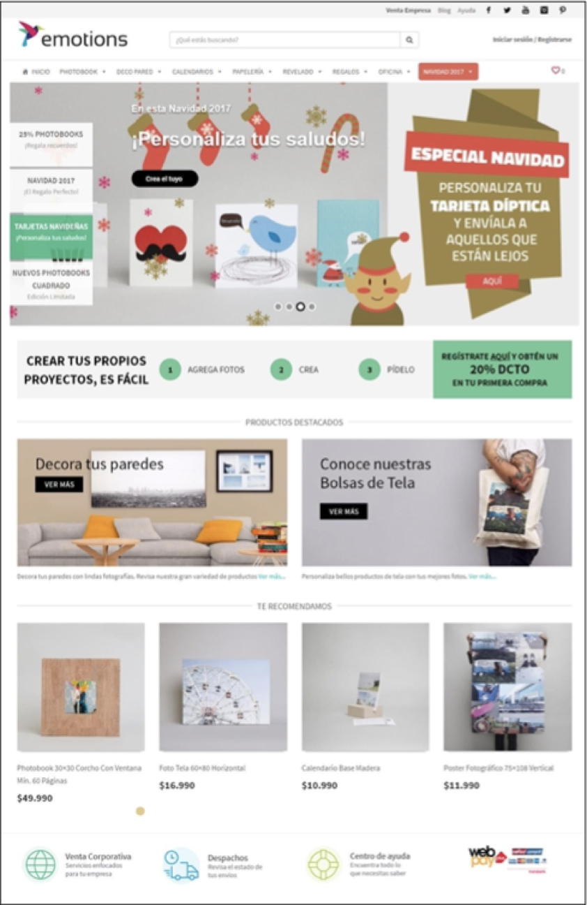
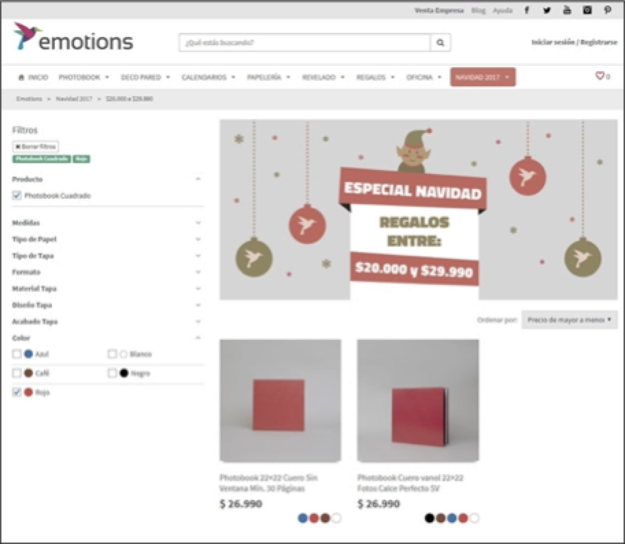
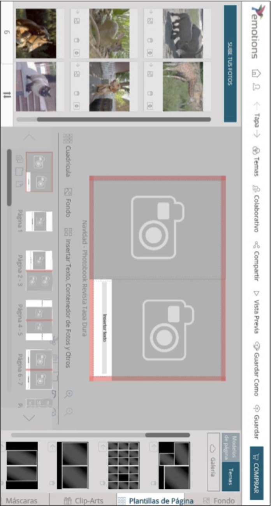
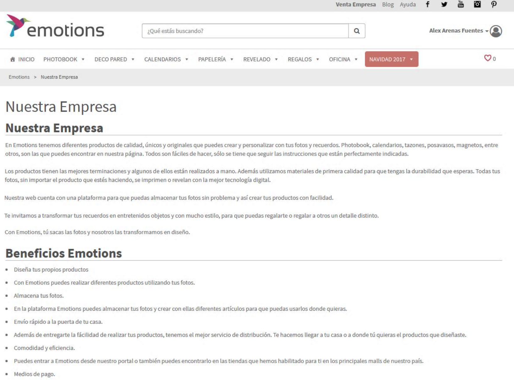

# Patrones de Diseño

En las siguientes páginas se muestran 4 interfaces distintas para la Página Web de emotions.cl. La primera corresponde a la página Home, la segunda a una página de información, la tercera al catálogo de productos y la última al sistema para crear productos realizados por emotions.

1. Usando un editor de imágenes deberán encerrar en un círculo/rectángulo las partes de las interfaces que reconozcan como Patrones de Organización de Espacio o de Navegación.
2. Usando lo que han aprendido en este curso, especialmente en la Sesión de Páginas Web, Realicen una crítica breve a la Página Home (Interfaz 1) en el siguiente recuadro. Su crítica podrá ser positiva o negativa, pero recuerden hacer uso de conceptos como convenciones o errores más frecuentes.
3. Suban un informe con las imágenes editadas y la respuesta a la pregunta 2 al Moodle del curso.

| Patrones de Organización del Espacio | Patrones de Navegación   | 
|--------------------------------------|--------------------------| 
| Marco Visual                         | Claros puntos de entrada | 
| Escenario Principal                  | Navegación global        | 
| Formato liquido                      | Concentrador             | 
| Secciones tituladas                  | Pirámide                 | 
| Pila de naipes                       | Panel Modal              | 
| Paneles cerrables                    | Mapa de secuencia        | 
| Paneles movibles                     | Migas de pan             | 
| Hoja de propiedades                  | Scroll con anotaciones   | 
| Alineación izquierda/derecha         | Secciones en colores     | 
| Balance Diagonal                     | Escotilla de escape      | 
| Revelación progresiva                | Habilitación progresiva  | 

## Imágenes de emotions.cl

